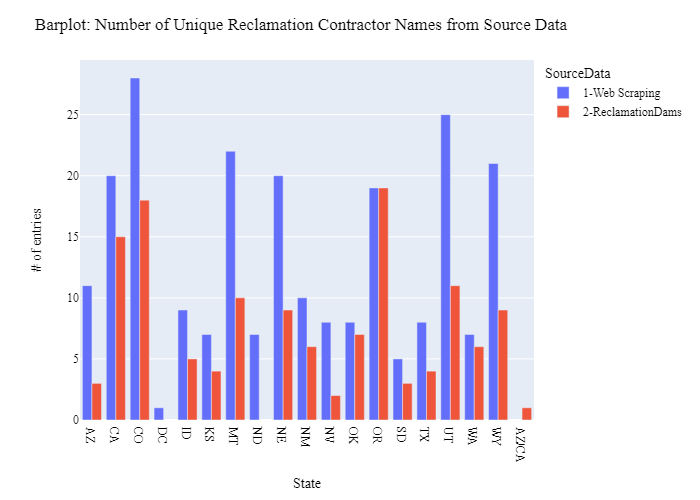
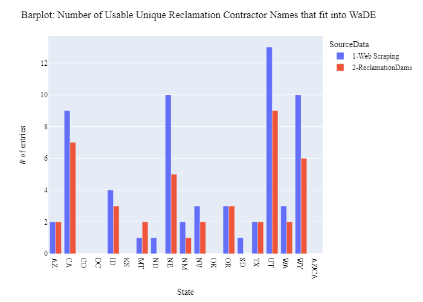
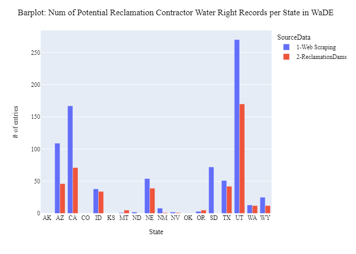

# Compiling Reclamation Contractor Names
Compiling a list of contractor names to match the state define owner names.  Goal to beter classify WaDE water rights with a owner type as "Reclamation Contractor".

## Source1_WebScraping
Used [USBR Site Web Link](https://www.usbr.gov/projects/).

Will use USBR website and web scrape information to find all contractor names.  

List of unique contractor names identified...
- 'Ainsworth Irrigation District', 'Boise Project Board of Control', 'Bridger Valley Water Conservancy District', 'Browns Creek Irrigation District', 'Buford-Trenton Irrigation District', 'California Department of Water Resources', 'Canadian River Municipal Water Authority', 'Carbon Water Conservancy District', 'Carlsbad Irrigation District', 'Casitas Municipal Water District', 'Central Arizona Project', 'Central Irrigation District', 'Central Oregon Irrigation District', 'Central Utah Water Conservancy District', 'Chimney Rock Irrigation District', 'City of Corpus Christi', 'City of Rapid City', 'Coachella Valley Water District', 'Cottonwood Creek Consolidated Irrigation Company', 'Deaver Irrigation District', 'Eden Valley Irrigation and Drainage District', 'El Dorado Irrigation District', 'Emery Water Conservancy District', 'Farmers Irrigation District', 'Frenchman Valley Irrigation District', 'Gering Irrigation District', 'Goshen Irrigation District', 'Greenfields Irrigation District', 'Hammond Conservancy District', 'Heart Mountain Irrigation District', 'Imperial Irrigation District', 'Kittitas Reclamation District', 'Lewiston Orchards Irrigation District', 'Little Wood River Irrigation District', 'Loup River Public Power District', 'Lower Powder River Irrigation District', 'Mann Creek Irrigation District', 'Mapleton Irrigation Company', 'Maricopa Water District', 'Midvale Irrigation District', 'Mirage Flats Irrigation District', 'Moon Lake Water Users Association', 'Newton Water Users Association', 'Ogden River Water Users Association', 'Okanogan Irrigation District', 'Owl Creek Irrigation District', 'Palo Verde Irrigation District', 'Pathfinder Irrigation District', 'Pershing County Water Conservation District', 'Provo River Water Users Association', 'San Benito County Water District', 'San Diego County Water Authority', 'Sanpete Water Conservancy District', 'Shoshone Irrigation District', 'Sidon Irrigation District', 'Solano County Water Agency', 'Truckee-Carson Irrigation District', 'U.S. Fish and Wildlife Service', 'Uintah Water Conservancy District', 'Vale Oregon Irrigation District', 'Weber Basin Water Conservancy District', 'Weber River Water Users Association', 'Willwood Irrigation District', 'Yakima-Tieton Irrigation District'

## Source2_ReclamationDams
Used [Reclamation Dam Data](https://www.arcgis.com/apps/mapviewer/index.html?layers=1df76b35789f448094cec79c53c42555) and compared ‘Primary Operating Entity’ with WaDE AllocationOwner.  

List of unique contractor names identified...
- 'Ainsworth Irrigation District', 'Boise Project Board Of Control', 'Bridger Valley Water Conservancy District', 'Bureau of Reclamation', 'Bureau of Reclamation,Ainsworth Irrigation District', 'Bureau of Reclamation,Mirage Flats Irrigation District', 'Canadian River Municipal Water Authority', 'Carbon Water Conservancy District', 'Casitas Municipal Water District', 'Central Arizona Water Conservation District', 'Central Oregon Irrigation District', 'Central Utah Water Conservancy District', 'Contra Costa Water District', 'Deaver Irrigation District', 'Eden Valley Irrigation And Drainage District', 'Farmers Irrigation District', 'Fort Shaw Irrigation District', 'Frenchman Valley Irrigation District', 'Goshen Irrigation District', 'Greenfields Irrigation District', 'Hammond Conservancy District', 'Imperial Irrigation District', 'Little Wood River Irrigation District', 'Madera Irrigation District', 'Mann Creek Irrigation District', 'Mirage Flats Irrigation District', 'Moon Lake Water Users Association', 'Newton Water Users Association', 'Ogden River Water Users Association', 'PacifiCorp', 'Pathfinder Irrigation District', 'Pershing County Water Conservation District', 'Provo River Water Users Association', 'Reeves County Water Improvement District 1', 'Salt River Valley Water Users Association', 'San Benito County Water District', 'Shoshone Irrigation District', 'Solano County Water Agency', 'Solano Irrigation District', 'South Columbia Basin Irrigation District', 'Truckee-Carson Irrigation District', 'Uintah Water Conservancy District', 'Vale Oregon Irrigation District', 'Weber Basin Water Conservancy District', 'Whitestone Reclamation District', 'Willwood Irrigation District'

## MergeResults
- Looking at take both Source 1 & Source 2 results and combine them.

**Figure 1:** Number of Unique Reclamation Contractor Names from Source Data

**Figure 2:** Number of Usable Unique Reclamation Contractor Names that fit into WaDE

**Figure 3:** Num of Potential Reclamation Contractor Water Right Records per State in WaDE
