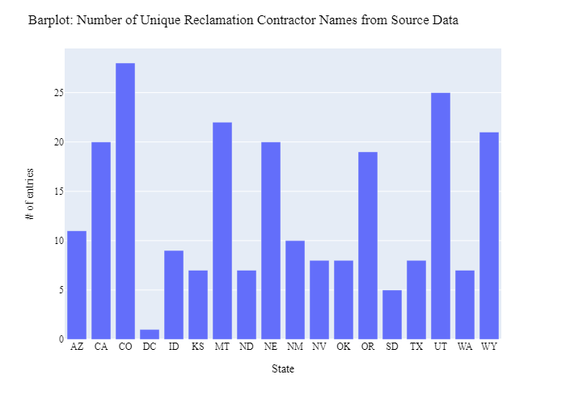
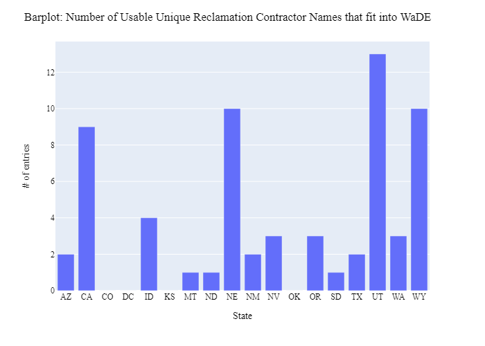
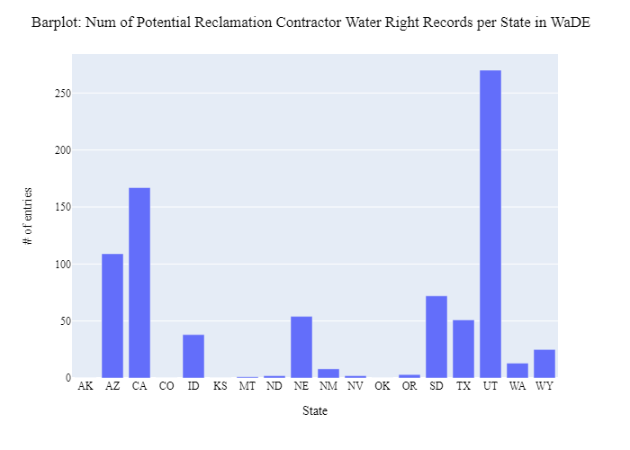

# Web scraping USBR Contractors
Looking for a way to create a new OwnerClassificationCV tag (i.e., "Reclamation Water Receiver") on contractor names who work with the USBR.  Will use USBR website and web scrape information to find all contractor names.
- [USBR Site Web Link](https://www.usbr.gov/projects/)
- [GitHub Web Link](https://github.com/WSWCWaterDataExchange/WaDE-Side-Projects/issues/2)
- [Google Doc Web Link](https://docs.google.com/spreadsheets/d/14kVRLyPtz-AhDk3i2QfyMEFPEjfecYbeBFM15jr63Qc/edit?usp=sharing)

***
### Notes:
- Use BeautifulSoup with python to web scrape HTML info from pages.  We are estimating there are > 500 projects to go through and look for contractors.  Not all sites will list our contractors.
- Use website + counter to load sites (ex: "https://www.usbr.gov/projects/index.php?id=" + counter_
- No good html tags to use, just look for everything in a col-6 tag with **.next_sibling** method to extract needed info.
- Used results, paired with WaDE AllocationOwnerName with exact match.

***
### Results: 
We were able to web scrap the contractor name and state of USBR contractors from that USBR website and save the results in a csv.

**Figure 1:** Number of Unique Reclamation Contractor Names from Source Data

**Figure 2:** Number of Usable Unique Reclamation Contractor Names that fit into WaDE

**Figure 3:** Num of Potential Reclamation Contractor Water Right Records per State in WaDE

***
### Comments and Errors: 
Further inspecting the data by hand I caught a few instances that will be hard to match.

AllocationOwner | Contractor Name | Issue
---- | ---- | ---- 
BITTER ROOT IRRIGATION DISTRICT (MT) | Bitter Root Project Irrigation District (MT) | the inclusion of the *Project* in contractor name prevented exact or partial match from working
BRIDGER VALLEY WATER CONSERVANCY DISTRICT (UT) | BRIDGER VALLEY WATER CONSERVANCY DISTRICT (WY), BRIDGER VALLEY WATER CONSERVANCY DISTRICT (MT) | The allocation owner name in WaDE is noted in UT, but the contractor names from USBR are noted in WY & MT

Tried doing a partial match both ways (checking AllocationOwner -in- Contractor Names, and again with checking Contractor Names -in- AllocationOwner) with similar poor results.
