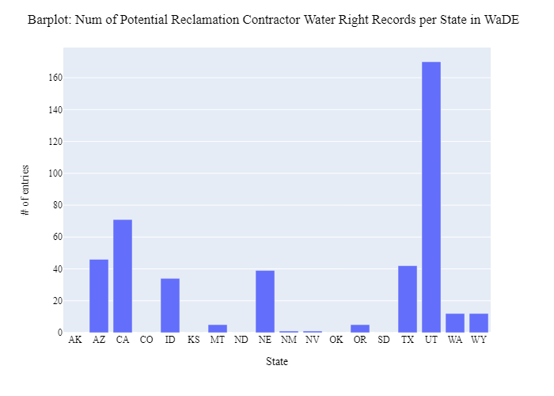

# Web scraping USBR Contractors
Looking for a way to create a new OwnerClassificationCV tag (i.e., "Reclamation Water Receiver") on contractor names who work with the USBR.  Will use USBR Reclamation Dams data to find all contractor names.
- [Reclamation Dams](https://www.arcgis.com/home/item.html?id=1df76b35789f448094cec79c53c42555)
- [GitHub Web Link for Notes](https://github.com/WSWCWaterDataExchange/WaDE-Side-Projects/issues/10)

***
### Notes:
- Used reclmation dams data, paired with WaDE AllocationOwnerName with exact match.

***
### Results: 
We were able to web scrap the contractor name and state of USBR contractors from that USBR website and save the results in a csv.

**Figure 1:** Number of Unique Reclamation Contractor Names from Source Data

**Figure 2:** Number of Usable Unique Reclamation Contractor Names that fit into WaDE

**Figure 3:** Num of Potential Reclamation Contractor Water Right Records per State in WaDE

